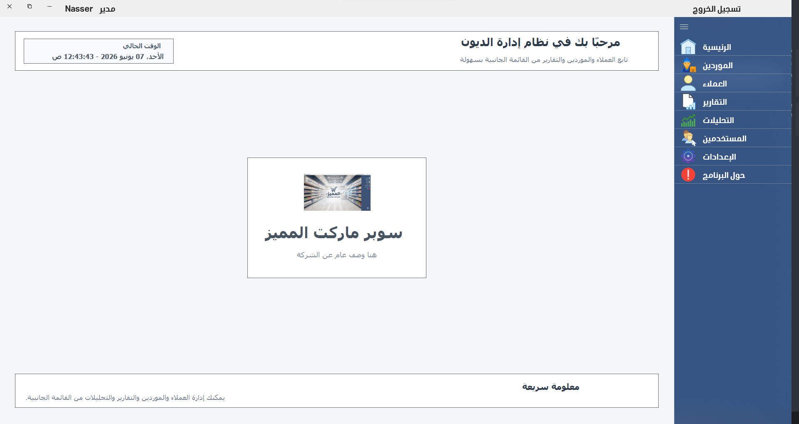
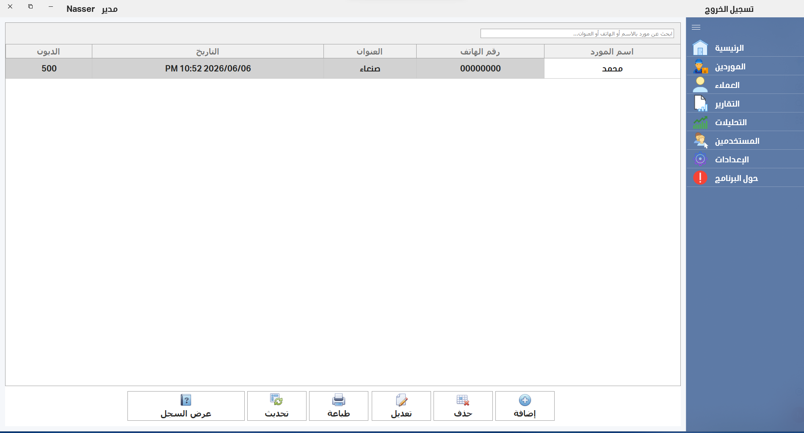
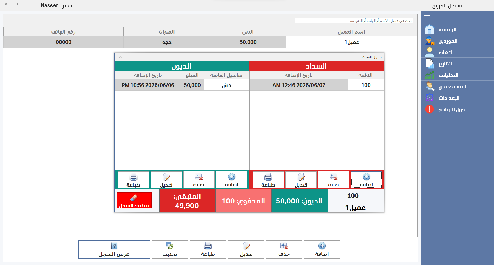
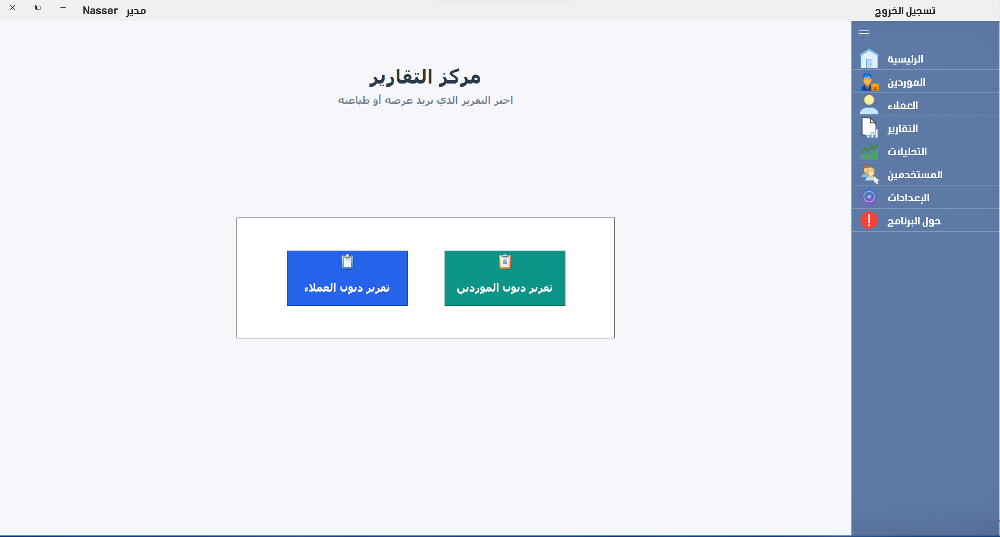
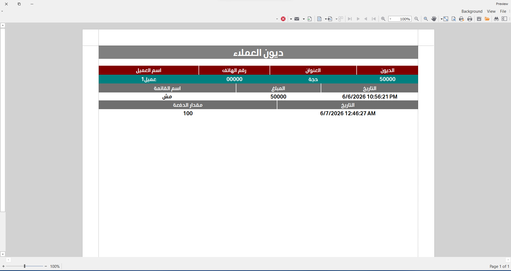
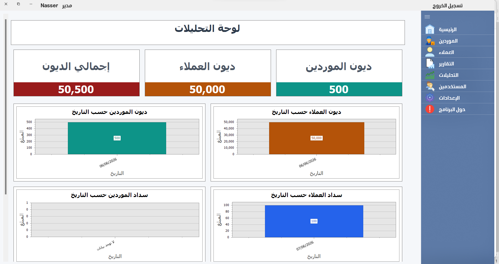
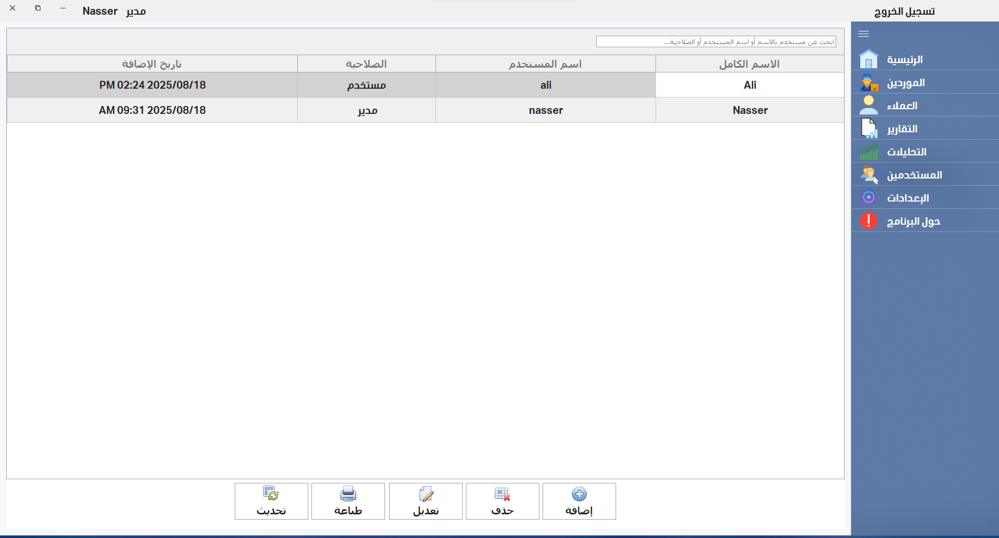
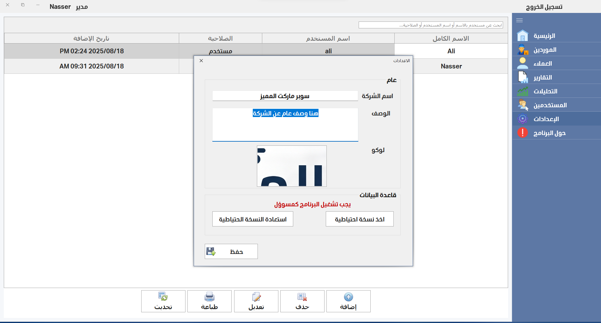
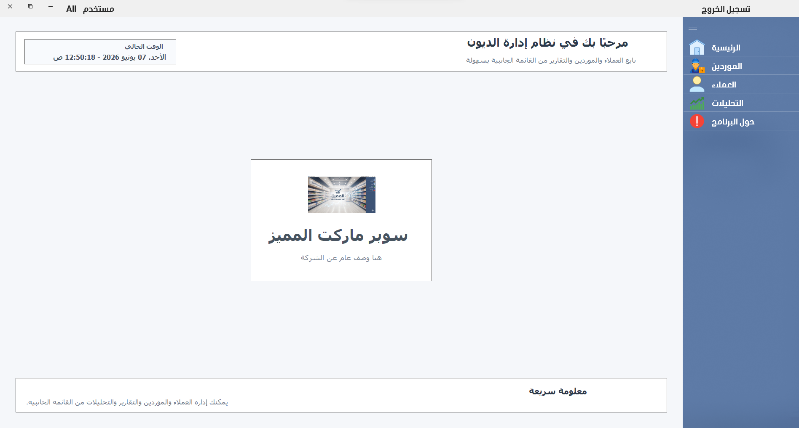

<h1 align="center">📊 نظام متكامل لإدارة الديون</h1>
<h3 align="center">تطبيق سطح مكتب محاسبي مخصص لإدارة الحسابات، العملاء، والموردين بكفاءة عالية</h3>

---

## 🚀 عن المشروع
نظام محاسبي وإداري متقدم مصمم لتسهيل ضبط الديون والعمليات المالية بكل سلاسة. تم بناؤه مع التركيز على سرعة الأداء المعالجة، وتوفير واجهة مستخدم مريحة وعصرية تناسب الشركات وأصحاب المشاريع.

**🛠️ التقنيات المستخدمة:**
* **لغة البرمجة:** C#
* **تصميم وتنسيق الواجهات:** مكتبة DevExpress المتطورة

---

## 🎬 استعراض النظام (فيديو)
> **ملاحظة:** 🔗 [لمشاهدة فيديو استعراض النظام وتفاصيل التطوير اضغط هنا](https://www.facebook.com/share/v/1JHxtNcFeK/):
---

## 📸 جولة داخل النظام (لقطات الشاشة)

<h3 align="center">1️⃣ الواجهات الأساسية وسجلات العمليات</h3>

  
  
  

  <b>الصورة 1: الواجهة الرئيسية للنظام</b> | 
  <b>الصورة 2: إدارة شاشة الموردين</b> | 
  <b>الصورة 3: عرض سجل العملاء بالتفصيل</b>

 

<h3 align="center">2️⃣ مركز التقارير والتحليلات البيانية</h3>

  
  
  

  <b>الصورة 4: مركز التقارير الشامل</b> | 
  <b>الصورة 5: تقرير ديون العملاء بدقة</b> | 
  <b>الصورة 6: لوحة التحليلات الإحصائية</b>

 

<h3 align="center">3️⃣ إدارة الصلاحيات، الإعدادات، والأمان</h3>

  
  
  

  <b>الصورة 7: التحكم بالمستخدِمين وصلاحياتهم</b> | 
  <b>الصورة 8: إعدادات وتخصيص النظام</b> | 
  <b>الصورة 9: شاشة تسجيل دخول مستخدم عادي</b>

---

## 📬 للتواصل والاستفسار
إذا كنت ترغب في الحصول على نسخة من النظام أو تعديل مخصص يناسب مشروعك، يمكنك التواصل معي مباشرة عبر وسائل التواصل المتاحة في حسابي الرئيسي.
